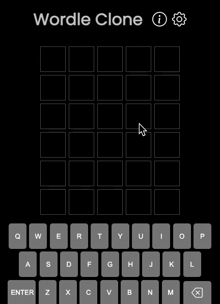
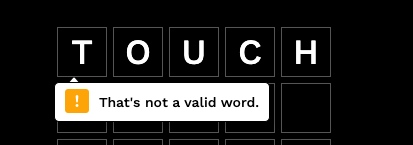

# [Play Wordle](https://bestwordle.netlify.app/)

# Description

I built a clone of wordle! However I spiced it up by adding a setting where you can change the length of the word to guess!

# Technologies

HTML/CSS, SCSS, Javascript, [Free Dicionary API](https://dictionaryapi.dev/) (to check whether words are valid)

# Bugs

This is the fault of the dictionary API. I should switch to use a different API that is recognizes all English words properly.

# Next Steps?

- refactor code for modals to avoid repetition
- Fix styling so that keyboard is closer to the grid
- Use a different, more accurate dictionary API (which checks for valid words)
- Enable players to create a custom word for a game, and then send the link to their friends!
  - When playing a custom game, show a message: You are guessing someone's wordle!
- Grab answer-words from an API (answers are currently hard coded)
- provide hints
